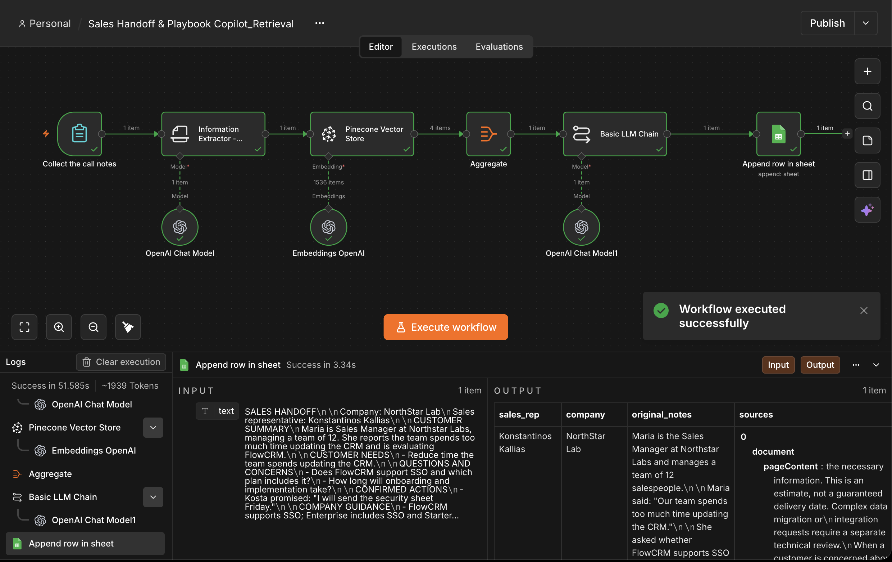
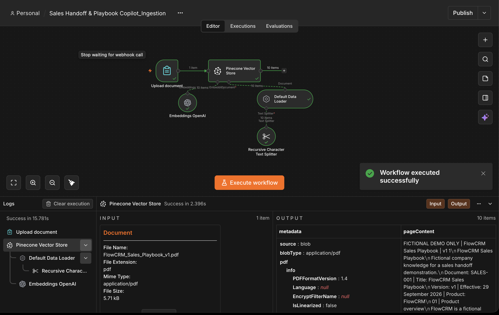
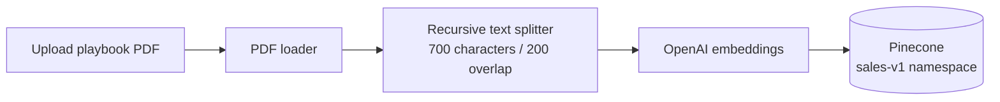
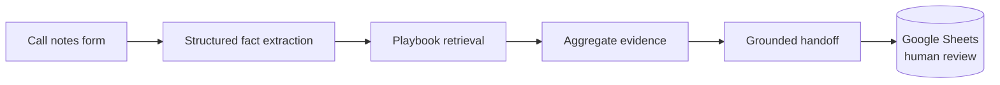

# Sales Handoff & Playbook Copilot

An n8n-based RAG prototype that turns fictional sales discovery notes into a structured, evidence-grounded handoff for an account executive.

It keeps three things separate: what the customer actually said, what the company playbook supports, and what the AI suggests next. That separation helps prevent a possibility from becoming a promise.



## Why this project

Sales handoffs often lose the details that matter: customer needs, objections, commitments, owners, deadlines, and the evidence behind recommended guidance. This project combines sales-domain experience with AI automation to make that transfer more consistent and reviewable.

The prototype demonstrates:

- structured extraction from unstructured call notes;
- retrieval-augmented generation over a sales playbook;
- explicit handling of commitments and weak signals;
- grounded responses with an abstention path;
- a human-review queue in Google Sheets; and
- credential-safe, reusable n8n workflow exports.

## How it works

### 1. Knowledge ingestion

The ingestion workflow accepts a fictional sales-playbook PDF, splits it into overlapping chunks, creates OpenAI embeddings, and stores the chunks in a dedicated Pinecone namespace.





### 2. Retrieval and handoff generation

The retrieval workflow collects the company, sales representative, and call notes through an n8n form. It extracts structured facts, retrieves relevant playbook passages, drafts a concise handoff, and appends the full record to Google Sheets with a `Pending` review status.



## Output contract

The generated handoff contains:

1. company and sales representative;
2. customer summary;
3. customer needs;
4. questions and concerns;
5. confirmed actions with owner and deadline;
6. company guidance based only on retrieved documents;
7. missing information; and
8. up to three clearly labelled suggestions.

The prompt explicitly rejects invented facts, prices, promises, and product features. If the knowledge base does not support an answer, the workflow returns `No supporting information found.`

## Reliability choices

- **Evidence before advice:** customer facts, retrieved guidance, and suggestions remain distinct.
- **Commitment control:** words such as “might,” “maybe,” and “next quarter” are not treated as confirmed actions.
- **Prompt-injection resistance:** the extractor is instructed not to follow commands embedded in call notes.
- **Human review:** every result is logged with `review_status = Pending` instead of being sent directly to a customer.
- **Fictional demo data:** the repository contains no real customer or company records.
- **No credentials:** credential references, workflow identifiers, webhook IDs, and the private Google Sheet ID were removed from the published exports.

## Technology

- n8n for orchestration, forms, routing, and review logging
- OpenAI chat models for structured extraction and handoff generation
- OpenAI embeddings for semantic search
- Pinecone for vector storage and retrieval
- Google Sheets for the reviewer queue
- JSON-based workflow exports for version control and reuse

## Repository structure

```text
.
├── assets/
│   ├── ingestion-workflow.png
│   └── retrieval-workflow.png
├── docs/
│   ├── architecture.md
│   └── evaluation-plan.md
├── sample-data/
│   ├── call-notes.md
│   └── review-sheet-columns.csv
├── workflows/
│   ├── ingestion.json
│   └── retrieval.json
├── SECURITY.md
└── README.md
```

## Run the prototype

1. Import `workflows/ingestion.json` and `workflows/retrieval.json` into n8n.
2. Connect your own OpenAI, Pinecone, and Google Sheets credentials.
3. Create a Pinecone index compatible with your embedding model and select it in both workflows. The demo uses the `sales-v1` namespace.
4. Create a Google Sheet with the columns in `sample-data/review-sheet-columns.csv`, then replace `YOUR_GOOGLE_SHEET_ID` in the retrieval workflow through the n8n UI.
5. Run the ingestion workflow and upload a fictional PDF playbook.
6. Run the retrieval workflow and submit fictional call notes.
7. Review the generated record in Google Sheets before any downstream use.

> The screenshots show a successful prototype execution. Services, model availability, node versions, and Pinecone index settings may change, so verify them in your own environment.

## Evaluation

The proposed test set covers explicit commitments, weak signals, missing evidence, outdated guidance, and prompt injection. See [docs/evaluation-plan.md](docs/evaluation-plan.md) for acceptance criteria and suggested metrics.

## Current limitations and next steps

This repository documents a working portfolio prototype, not a production CRM system.

- Add document metadata during ingestion so every answer can reliably cite title, version, and section.
- Add metadata filtering and reranking so current guidance wins over outdated material.
- Replace the spreadsheet review queue with PostgreSQL for stronger auditability and analytics.
- Add automated evaluation for retrieval hit rate, citation correctness, missing-field detection, latency, and cost.
- Add retries, error workflows, idempotency controls, access control, and monitoring before production use.

## Portfolio context

Built as a practical AI automation project connecting SDR and consultative-sales experience with RAG, structured outputs, workflow design, and human-in-the-loop review.

